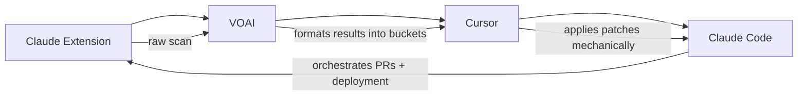

# NØID Master Prompt Doc + Quick Paste Pack

This document consolidates all workflows, debrief logs, templates, and one-liners into a single pinned cheat-sheet for NØID's multi-agent workflow.

============================================================
## ■■ Multi-Agent Command Pack
============================================================

### ■ Claude Code Debrief Log (Paste at 4PM)
-----------------------------------------
You are rejoining the NØID/Noidlux workflow in **FIX MODE**.

**Current Status:**
- **Claude Extension**: Workflow validated. Awaiting real scan results.
- **VOAI**: Formats raw Extension results into structured buckets.
- **Cursor**: Running luxgrid-ui repo, ~70% fixes done (Next.js configs, token structure, builds stable).

**Your Tasks:**
1. Parse VOAI scan results.
2. Generate minimal, reversible Next.js patches (file+line refs).
3. **Git workflow:**
   ```bash
   git checkout -b fix/scan-issues
   git add -A
   git commit -m "Fix: audit scan issues"
   git push -u origin fix/scan-issues
   gh pr create --fill --base main --title "Fix: audit issues" --body "Fixes from Extension/VOAI scan reports"
   ```
4. Validate (`npm run build`).
5. Deploy → re-scan → merge clean build.

**Next:**
- UI Mock-Up Starter Prompt (brand visuals: colors, spacing, typography).
- Collateral Starter Prompt (business cards + brochures).

============================================================
## ■ VOAI Scan Template
============================================================

```markdown
## ■ Console Errors
- [list errors]

## ■ Network Issues
- [list 4xx/5xx]

## ■ Performance
- Perf: __/100 • A11y: __/100 • SEO: __/100
- LCP: __s • CLS: __ • TBT: __ms
- Issues: [list]

## ■ Accessibility
- Score: __/100
- Issues: [list]

## ■ Security
- [missing headers, insecure cookies, etc.]
```

============================================================
## ■ One-Liners (Quick Paste Shortcuts)
============================================================

### 1. Claude Extension:
```
Audit this page: list console errors, 4xx/5xx requests, layout/accessibility issues, and propose minimal Next.js fixes with file+line references.
```

### 2. VOAI:
```
Format Extension results using the Scan Template.
```

### 3. Cursor:
```
Apply patches from formatted scan results (Console, Network, Perf, A11y, Security). Keep changes minimal, reversible, and aligned with Next.js best practices.
```

### 4. Claude Code (Debrief):
```
Parse VOAI formatted results → generate Next.js patches with file+line refs → guide git workflow → validate builds → deploy to Vercel → re-scan preview.
```

============================================================
## ■ 4-Agent Relay Workflow
============================================================



**Workflow Steps:**
1. **Claude Extension** → raw scan
2. **VOAI** → formats results into buckets
3. **Cursor** → applies patches mechanically
4. **Claude Code** → orchestrates PRs + deployment

============================================================
## ■ Brand Guidelines Quick Reference
============================================================

### Brand DNA
- **Minimalist**: Clean grid, sharp typography, intentional whitespace
- **Luxury**: Subtle gradients, refined shadows, confident interactions
- **Accessible**: WCAG-compliant color contrasts and keyboard navigation
- **Emotional Triggers**: Seamless animations that evoke elegance
- **Gamification**: Delightful micro-interactions for onboarding and user retention

### Technical Stack
- React + Next.js
- Tailwind CSS
- Storybook (component previews)
- Jest + React Testing Library
- Vite (bundler)
- Vercel (deployment)

============================================================
## ■ Git Workflow Templates
============================================================

### Standard Fix Branch
```bash
git checkout -b fix/scan-issues
git add -A
git commit -m "Fix: audit scan issues"
git push -u origin fix/scan-issues
gh pr create --fill --base main --title "Fix: audit issues" --body "Fixes from Extension/VOAI scan reports"
```

### Feature Branch
```bash
git checkout -b feature/[feature-name]
git add -A
git commit -m "feat: [description]"
git push -u origin feature/[feature-name]
gh pr create --fill --base main --title "Feature: [title]" --body "[description]"
```

### Hotfix Branch
```bash
git checkout -b hotfix/[issue-name]
git add -A
git commit -m "hotfix: [description]"
git push -u origin hotfix/[issue-name]
gh pr create --fill --base main --title "Hotfix: [title]" --body "[description]"
```

============================================================
## ■ Validation Commands
============================================================

### Build & Test Pipeline
```bash
npm run build              # Validate Next.js build
npm run test              # Run Jest tests
npm run security:scan     # Security audit
npm run performance:audit # Lighthouse CI
npm run brand:validate    # Brand consistency check
```

### Deployment Pipeline
```bash
vercel --prod             # Deploy to production
vercel preview           # Deploy preview build
```

============================================================
## ■ Emergency Procedures
============================================================

### Rollback Command
```bash
npm run rollback         # Automated rollback script
```

### Quick Status Check
```bash
npm run automation:status # Monitor system health
```

### Council Activation
```bash
npm run council:run      # Activate AI council for complex decisions
```

============================================================

**Last Updated**: $(date)  
**Version**: 2.1.0  
**Maintainer**: NØID/Noidlux Team

---
© 2025 LuxGrid — MIT License